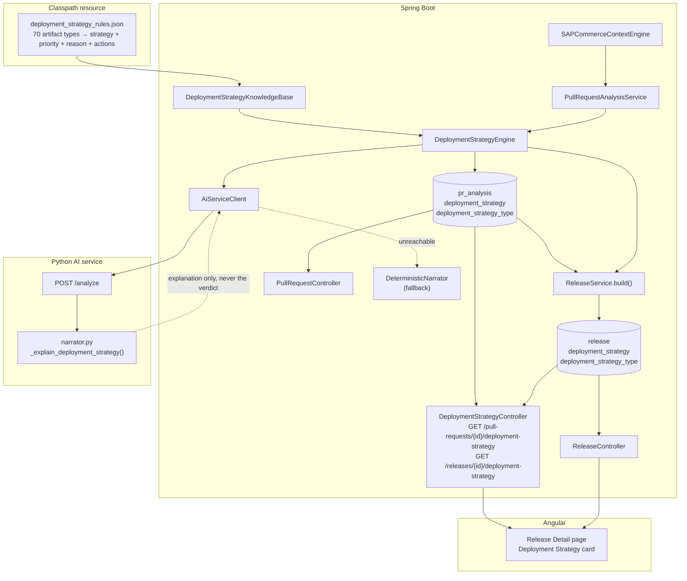
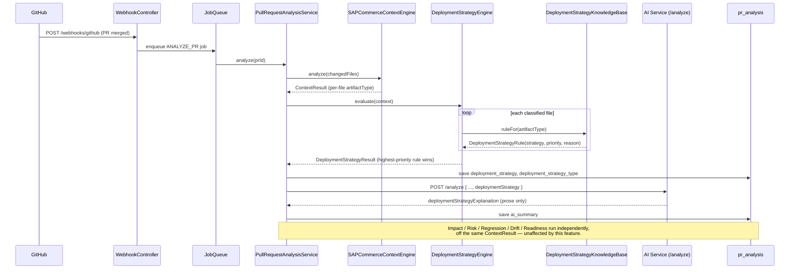

# Deployment Strategy Advisor

Recommends **ROLLING** or **MIGRATE** for every pull request and every
release, from deterministic SAP Commerce knowledge alone. AI never decides
the strategy — it only explains why the deterministic engine already
decided it.

This document covers the design, the data flow, the REST API, and — the
part that matters most for maintaining this feature — how to add or change
a deployment rule **without touching Java**.

---

## 1. Philosophy

```
SAP Commerce Context Engine
        │
        ▼
Deployment Strategy Engine   ← pure rule lookup, zero AI, zero heuristics
        │
        ▼
Deployment Recommendation (ROLLING | MIGRATE)
        │
        ▼
AI Explanation                ← prose only; cannot change the value above
```

The engine never reads source code or a diff. It reads exactly what the
Context Engine already produced for each changed file — its SAP Commerce
**artifact type** (`items_xml`, `facade`, `occ_controller`, …) — and looks
that type up in a JSON rule table. That is the entire decision.

## 2. Where it sits in the existing pipeline

```
GitHub PR merged
      │
      ▼
GitHub Webhook → IngestionService → PullRequest row + job enqueued
      │
      ▼
PullRequestAnalysisService.analyze()
      │
      ├─ 1. SAPCommerceContextEngine.analyze(changedFiles)      → ContextResult
      ├─ 1.5 DeploymentStrategyEngine.evaluate(context)         → DeploymentStrategyResult   ★ NEW
      ├─ 2. ImpactAnalyzer / RiskEngine / RegressionRecommender / ConfigurationDriftEngine
      ├─ 3. DeploymentReadinessEngine.evaluate(...)
      └─ 4. AI narration (AiServiceClient.analyze → AiAnalysisResponse.deploymentStrategyExplanation)   ★ NEW
      │
      ▼
PrAnalysis row persisted (deployment_strategy, deployment_strategy_type)   ★ NEW columns
```

At release build time (`ReleaseService.build()`), the strategies already
computed for every resolved pull request are rolled up:

```
POST /releases/{id}/build
      │
      ▼
ReleaseResolver resolves the PR set from the Git commit graph
      │
      ▼
DeploymentStrategyEngine.aggregate(perPrResults)   ★ NEW
      │
      ▼
Release row persisted (deployment_strategy, deployment_strategy_type)   ★ NEW columns
```

**No existing engine, endpoint, or table was modified.** Every change this
feature makes is additive: two new nullable columns on two existing tables,
one new field threaded through the AI request/response records, and new
files everywhere else.

## 3. Component diagram



## 4. Sequence diagram — one pull request



## 5. The rule engine

### 5.1 Priority resolution

A pull request can touch several artifact types at once. Every matched rule
carries a `priority`; the **highest priority across every changed file**
wins, and that rule's `strategy` becomes the recommendation for the whole
pull request.

`deployment_strategy_rules.json` maintains one invariant that makes this
trivial: **every `MIGRATE` rule's priority (75–100) is higher than every
`ROLLING` rule's priority (1–35)**. So "highest priority wins" and "any
migrate-tier file forces migrate" are the same rule, with no special-casing
in Java. `DeploymentStrategyKnowledgeBaseTest.everyMigrateRuleOutranksEveryRollingRule`
pins this invariant so a badly-edited rule file fails a test instead of
silently breaking priority resolution.

```json
{ "artifactType": "items_xml", "strategy": "MIGRATE", "priority": 100 }
{ "artifactType": "facade",    "strategy": "ROLLING", "priority": 30  }
```

A pull request touching `DefaultCheckoutFacade.java` (facade, 30) and
`items.xml` (100) resolves to **MIGRATE** — exactly the "Rule Priority"
example the feature was specified against.

### 5.2 Reasons and recommendations

Only the reasons and recommended actions belonging to the **winning
strategy's tier** are surfaced — if the verdict is MIGRATE, a facade change
in the same PR does not pollute the explanation with rolling-tier reasoning.
Two fixed confirmation lines are appended based on the final strategy
(`"Database schema update expected"` / `"No database schema changes"`, etc.)
so the dashboard card always reads like the feature's mockup regardless of
which specific rule fired.

### 5.3 Confidence

- **HIGH** — every changed file was classified
- **MEDIUM** — at least one file was classified, but some could not be
- **LOW** — nothing could be classified (or no pull requests were resolved
  yet, at the release level); the strategy defaults to ROLLING and says so,
  it never guesses

## 6. Adding or changing a rule — no Java change required

This is the "future rules without touching Java" requirement.

1. Open `backend/src/main/resources/deployment-strategy/deployment_strategy_rules.json`.
2. Find (or add) an entry keyed by the SAP Commerce artifact type — the same
   key `SapCommerceKnowledgeBase` (`sap_context.json`) already assigns to a
   changed file, e.g. `"occ_controller"`, `"impex_general"`.
3. Set `strategy` (`"ROLLING"` or `"MIGRATE"`), `priority` (1–35 for
   rolling, 75–100 for migrate — keep the gap), `reason` (shown verbatim on
   the dashboard), and `recommendedActions` (the checklist).
4. Restart the backend. `DeploymentStrategyKnowledgeBase` loads the file
   once at startup — that is the only place this JSON is read.

**A brand-new SAP Commerce artifact type** (one the Context Engine's own
knowledge base does not classify yet) needs a `sap_context.json` entry
first — the Deployment Strategy Engine never sees a file the Context Engine
did not already classify. If an artifact type exists in the Context Engine
but has no matching entry here, `defaultStrategy`/`defaultPriority`/
`defaultReason` at the top of the file apply automatically, so nothing
throws — it just recommends ROLLING conservatively and says a rule is
missing.

No Java file, migration, or REST contract changes for either case.

## 7. REST API

| Method | Path | Returns |
|---|---|---|
| `GET` | `/api/v1/pull-requests/{id}/deployment-strategy` | `DeploymentStrategyResult` for one pull request. 404 before analysis. |
| `GET` | `/api/v1/releases/{id}/deployment-strategy` | `DeploymentStrategyResult` aggregated across the release's resolved pull requests. 404 before build. |
| `GET` | `/api/v1/pull-requests/{id}` | Existing endpoint; now also carries `deploymentStrategy` and `deploymentStrategyType`. |
| `GET` | `/api/v1/pull-requests` | Existing endpoint; each `Summary` row now carries `deploymentStrategyType`. |
| `GET` | `/api/v1/releases/{id}` | Existing endpoint; now also carries `deploymentStrategyType`. |

`DeploymentStrategyResult` shape:

```jsonc
{
  "strategy": "MIGRATE",                 // ROLLING | MIGRATE
  "confidence": "HIGH",                  // HIGH | MEDIUM | LOW
  "reasons": ["items.xml — ...", "Database schema update expected", "System update required"],
  "recommendedActions": ["Execute Migrate Deployment", "Perform System Update", "..."],
  "matches": [ { "filePath": "...", "artifactType": "items_xml", "strategy": "MIGRATE", "priority": 100, "reason": "..." } ],
  "classifiedFileCount": 3,
  "unclassifiedFileCount": 0,
  "knowledgeBaseVersion": "1.0.0",
  "provenanceClass": "RULE_OUTPUT"
}
```

## 8. AI integration contract

`AiAnalysisRequest` gained one field: `deploymentStrategy`, the exact
`DeploymentStrategyResult` computed above — the same security posture as
every other field on that record (see its Javadoc): no source code, no
diff, deterministic facts only.

`AiAnalysisResponse` gained one field: `deploymentStrategyExplanation`, a
1–2 sentence prose explanation of *why* the given strategy is correct. The
prompt (`ai-service/app/prompts.py`) explicitly instructs the model it
cannot choose or influence the strategy, only explain the one already
decided. The Python deterministic narrator (`narrator.py`) and the
Java-side fallback (`DeterministicNarrator`) both produce the same field
when the model is unavailable — exactly the repair-retry-then-template
pattern every other explanation on this platform already follows.

## 9. Data model

| Table | New columns |
|---|---|
| `pr_analysis` | `deployment_strategy` (JSON), `deployment_strategy_type` (`VARCHAR(20)`) |
| `release` | `deployment_strategy` (JSON), `deployment_strategy_type` (`VARCHAR(20)`) |

Migrations: `V4__deployment_strategy.sql` (H2 and PostgreSQL).

## 10. Tests

- `DeploymentStrategyKnowledgeBaseTest` — the rule file loads, covers all 70
  artifact types, and the priority-band invariant holds.
- `DeploymentStrategyEngineTest` — MIGRATE for `items.xml`, ROLLING for a
  facade-only change, priority resolution across mixed files, reason
  deduplication, unclassified-file confidence downgrade, empty-input
  honesty, and release-level aggregation inheriting the riskiest PR.

## 11. Frontend

- `core/models/deployment-strategy.ts` — `DeploymentStrategyType`,
  `DeploymentStrategyMatch`, `DeploymentStrategyResult`.
- `ApiService.getReleaseDeploymentStrategy` / `getPullRequestDeploymentStrategy`.
- `shared/tone.ts` — `deploymentStrategyTone` (MIGRATE reads `danger`,
  ROLLING reads `success` — the operational weight, not a value judgement)
  and `confidenceTone`.
- Release Detail page — a new "Deployment Strategy" card between the
  headline stats and the pull-request list, matching the feature's mockup:
  strategy + confidence badges, a "Reason" checklist, a "Recommendations"
  checklist, and an honest empty state before the release has been built.
